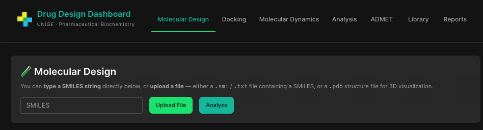
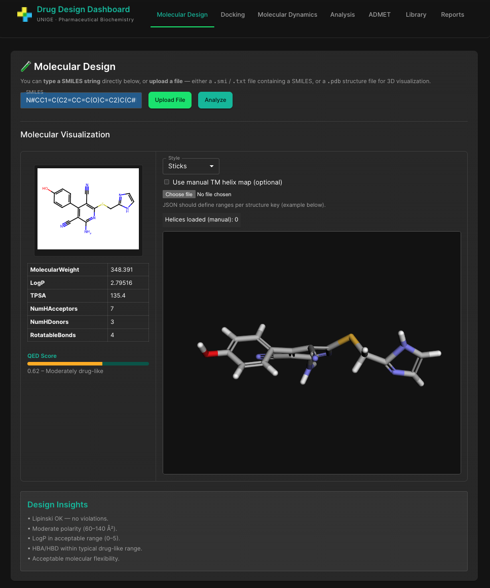
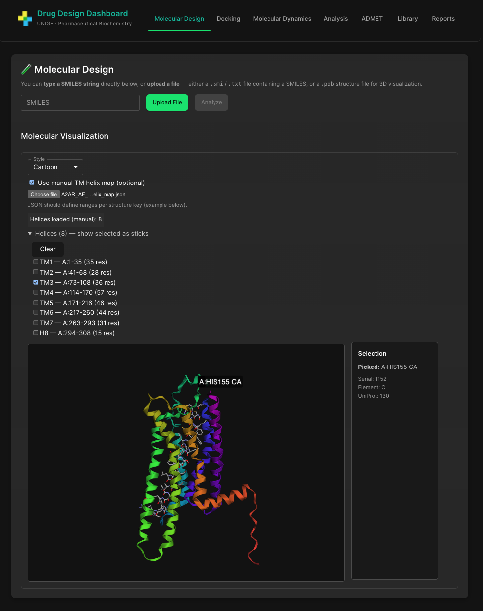
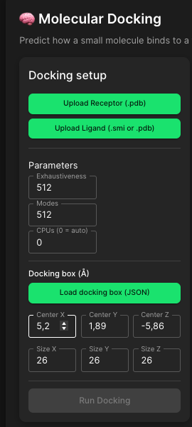
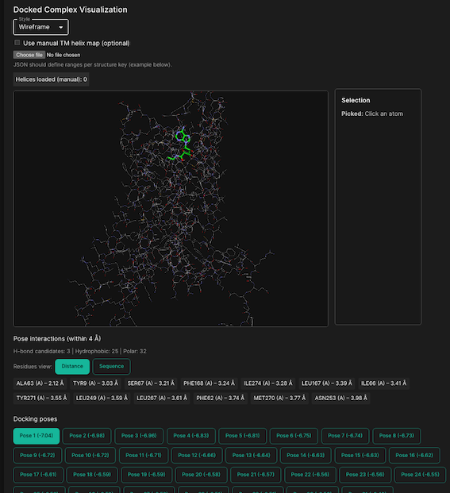
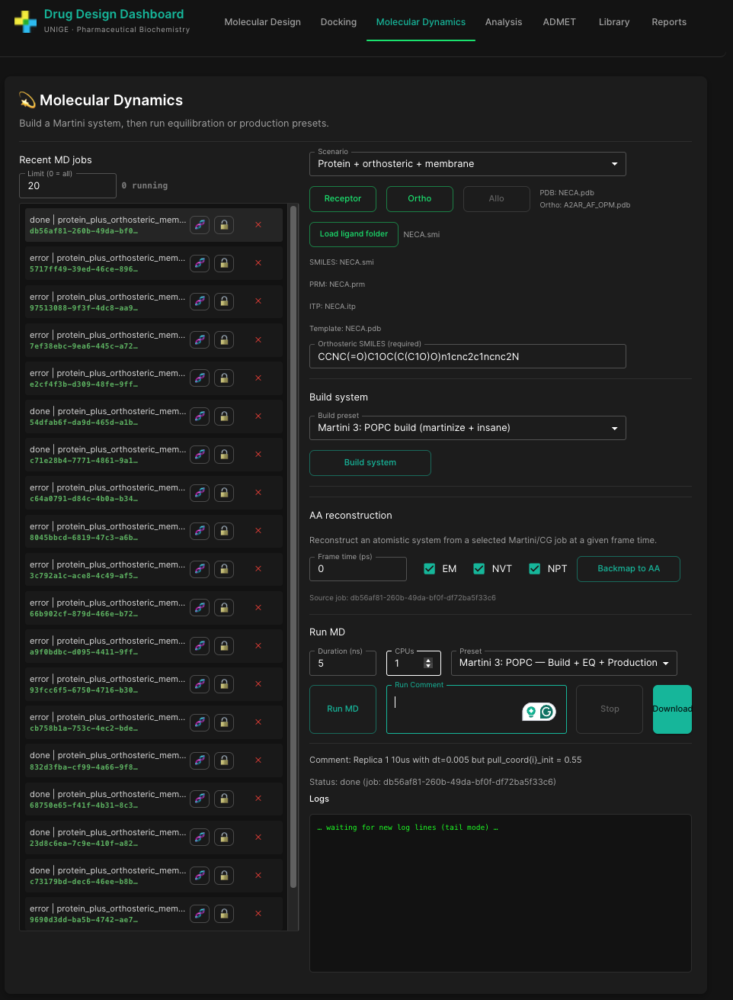
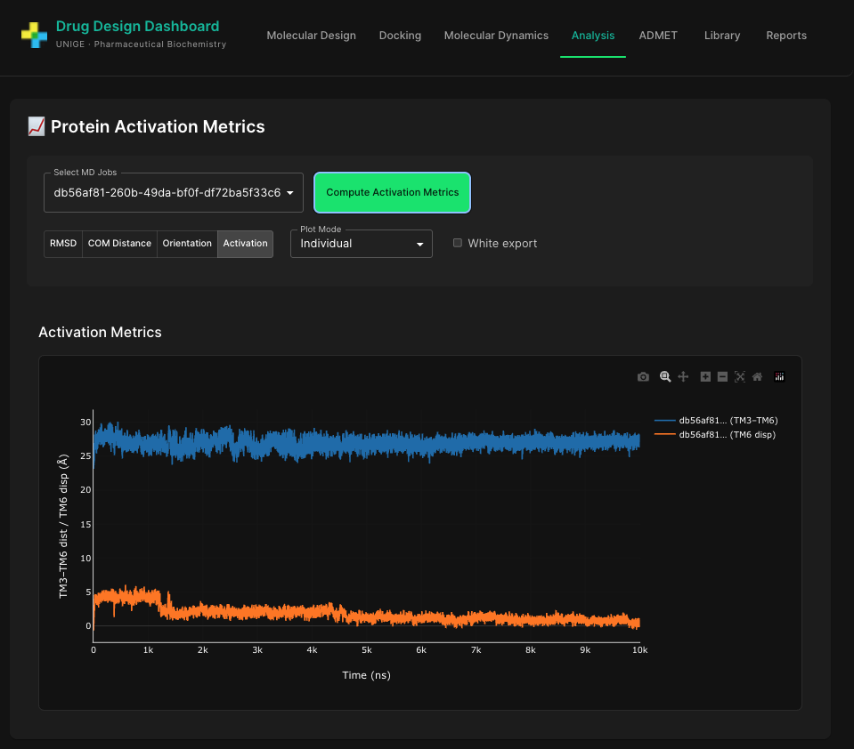
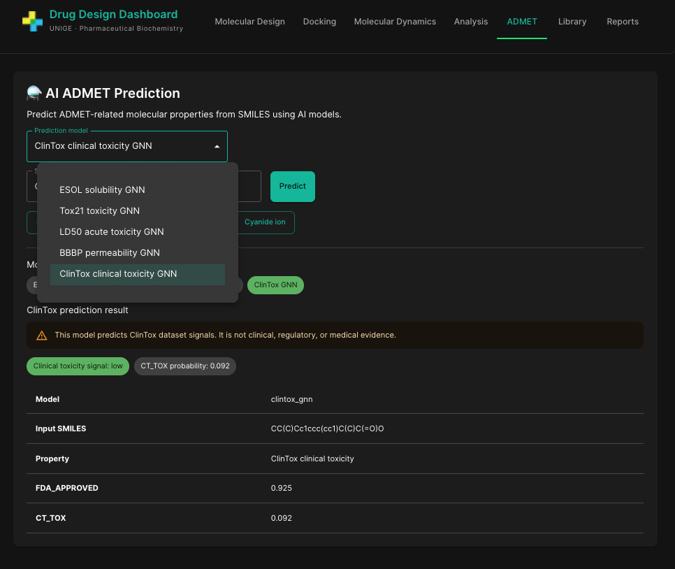
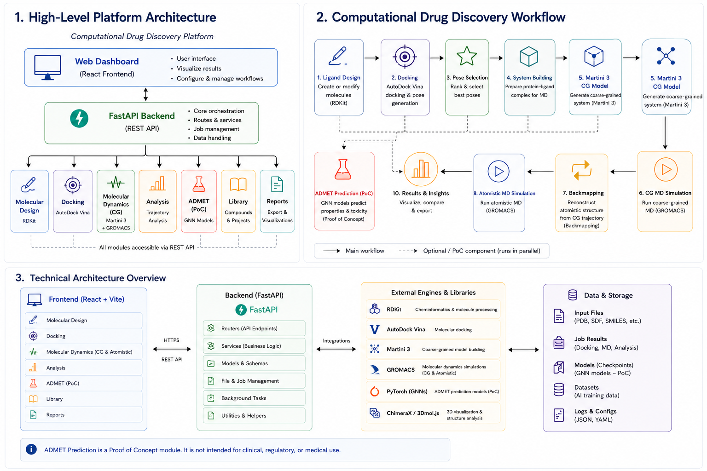

# Computational Drug Discovery Platform
> Developed as an independent initiative inspired by GPCR allosteric
> modulation and structure-based drug discovery research at the
> University of Geneva.
> 
A personal computational drug discovery platform integrating molecular
modelling, docking, multiscale molecular dynamics, cheminformatics and
simulation analysis within a unified research environment.

The platform is designed to support practical research workflows rather
than isolated tools, allowing researchers to move from molecular
structures to simulation, analysis, and decision-making within a single
environment.

---

## Project Background

The Drug Discovery Dashboard was initiated as a personal project to
explore modern computational drug discovery workflows and to integrate
multiple scientific tools within a unified platform.

The original motivation arose from an interest in allosteric modulation
of G protein-coupled receptors (GPCRs), particularly the challenge of
understanding how ligand binding influences receptor activation and
conformational dynamics. The project was conceived as a platform for
combining molecular modelling, docking, molecular dynamics simulations
and structural analysis within a single environment capable of
supporting hypothesis generation and lead optimisation.

The project was developed during my time at the University of Geneva,
where I collaborated with researchers from the Scapozza laboratory and
the ADORAM Therapeutics team. These interactions provided valuable
exposure to real-world drug discovery challenges and helped define the
scientific context in which the platform was conceived, particularly in
relation to protein targets, ligand design and structure-based drug
discovery.

The design, implementation and integration of the platform were carried
out independently as a personal initiative.
---

## Platform Preview

### Main Interface


*Figure 1. The dashboard provides a unified entry point to all major stages of the
computational drug discovery process.*

### Molecular Design

Interactive visualisation and exploration of proteins and ligands,
supporting structural inspection and molecular property analysis.

Features include:

- Protein and ligand visualisation
- SMILES import and molecular rendering
- Molecular descriptor calculation
- Drug-likeness assessment
- Atom and residue inspection
- Interatomic distance measurements
- Secondary-structure and binding-site exploration
- Customisable molecular representations (cartoon, sticks, surface)


*Figure 2a. Visualisation of a ligand and its properties*


*Figure 2b. Visualisation of a protein with detailed view of selected helix* 

### Docking

Protein-ligand docking workspace for running and inspecting docking
experiments.

Features include:

- Receptor and ligand upload
- AutoDock Vina docking workflow integration
- Configurable docking parameters and docking box definition
- Interactive docked-complex visualisation
- Multiple molecular representation styles
- Atom picking and structural inspection
- Docking pose browsing and score comparison
- Protein-ligand interaction analysis
- Residue-level interaction summaries
- Distance-based and sequence-based residue views
- Export of docked complexes for downstream analysis or simulation
- Docking run history and result management



*Figure 3. Docking module showing docking setup, interactive visualisation
of the docked protein–ligand complex, atom selection, protein–ligand
interaction analysis, residue-level contact summaries and ranked docking
poses.*

### Molecular Dynamics

Integrated molecular dynamics environment for building, launching,
monitoring and analysing Martini coarse-grained simulations, with
support for atomistic reconstruction workflows.

Features include:

- Protein-only, protein–ligand and membrane simulation workflows
- Automated Martini 3 system construction
- Ligand integration into coarse-grained systems
- Multiple simulation scenarios and build presets
- Automated equilibration and production workflows
- Configurable simulation parameters and run settings
- Real-time monitoring of simulation jobs
- Live log inspection during execution
- Persistent simulation history and job management
- One-click opening of simulation systems in ChimeraX directly from the
  job history
- CG → AA backmapping and atomistic reconstruction
- Automated atomistic equilibration pipelines (EM, NVT and NPT)
- Download of generated systems and simulation outputs


*Figure 4. Molecular Dynamics module showing automated Martini 3 system
construction, simulation job management, live monitoring, atomistic
reconstruction workflows and direct ChimeraX integration for structural
inspection of simulation systems.*

### Analysis

Trajectory analysis environment for the quantitative assessment of
molecular dynamics simulations, with a particular focus on receptor
activation metrics and conformational dynamics.

Features include:

- Analysis of individual simulations or multiple MD trajectories
- RMSD calculation and visualisation
- Centre-of-mass distance analysis
- Ligand orientation
- GPCR activation-state analysis
- TM3–TM6 intracellular distance monitoring
- TM6 displacement analysis
- Comparative analysis of multiple simulations
- Interactive visualisation of time-series metrics
- Publication-ready figure export
- Configurable plotting and visualisation options


*Figure 5. Analysis module showing quantitative assessment of molecular
dynamics trajectories through receptor activation metrics, including
TM3–TM6 intracellular distances and TM6 displacement measurements used
to characterise conformational state transitions.*


### ADMET

AI-assisted ADMET prediction module for estimating molecular properties
and early safety-related signals directly from SMILES strings.

Features include:

- SMILES-based molecular property prediction
- Selection between multiple GNN prediction models
- ESOL aqueous solubility prediction
- Tox21 toxicity pathway prediction
- LD50 acute-toxicity signal prediction
- BBBP blood-brain barrier permeability prediction
- ClinTox clinical toxicity signal prediction
- Example molecules for rapid model testing
- Probability scores and model-specific outputs
- Clear interpretation labels for predicted risk or property signals
- Safety warnings distinguishing model outputs from clinical,
  regulatory or medical evidence


*Figure 6. ADMET module showing AI-assisted prediction of molecular
properties and toxicity-related signals from SMILES strings using
multiple graph neural network models.*

---

## Overview

Modern computational drug discovery typically requires a fragmented
ecosystem of specialised tools for:

- Molecular visualisation
- Ligand preparation
- Docking
- Molecular dynamics simulations
- Trajectory analysis
- Cheminformatics
- ADMET assessment
- Machine learning

This project aims to unify these capabilities within a single
interactive platform designed for exploratory research, simulation
management, and future AI-driven drug discovery workflows.

---

## Architecture

The Drug Discovery Dashboard is a modular computational drug discovery
platform integrating molecular design, docking, molecular dynamics,
trajectory analysis and AI-assisted molecular property prediction within
a unified interface.



*Figure 7. Platform architecture showing the high-level system design,
computational drug discovery workflow and technical architecture of the
Drug Discovery Dashboard.*

The platform follows a modular architecture in which molecular design,
docking, molecular dynamics, analysis and machine-learning components
can be developed and executed independently while sharing a common data
and visualisation framework.

### Main Components

- **Molecular Design**: molecular visualisation, descriptor calculation
  and ligand exploration.
- **Docking**: protein-ligand docking using AutoDock Vina.
- **Molecular Dynamics**: Martini 3 system building, coarse-grained
  simulations, CG→AA backmapping and atomistic simulations using
  GROMACS.
- **Analysis**: trajectory analysis and receptor activation metrics.
- **ADMET (Proof of Concept)**: graph neural network models for
  molecular property prediction.
- **Library**: project and compound management.
- **Reports**: export and reporting functionality.

### Technology Stack

**Frontend**
- React
- Vite
- Plotly
- 3Dmol.js

**Backend**
- FastAPI
- Python

**Scientific Engines**
- RDKit
- AutoDock Vina
- Martini 3
- GROMACS
- ChimeraX

**Machine Learning**
- PyTorch
- Graph Neural Networks (Proof of Concept)

## Research Vision

The long-term objective of this project is to develop an integrated
computational drug discovery environment combining:

- Molecular modelling
- Molecular dynamics
- Cheminformatics
- Scientific data analysis
- Machine learning
- AI-assisted lead optimisation

within a unified research platform.

The goal is not simply to visualise molecules but to support the entire
decision-making process involved in computational drug discovery.

---

## Roadmap

### Phase 1 – Core Platform

- [x] Molecular visualisation
- [x] Descriptor calculation
- [x] Interactive dashboard
- [x] Molecular dynamics module
- [x] Analysis module

### Phase 2 – Advanced Simulation

- [x] Automated docking workflows
- [ ] Protein-ligand interaction fingerprints
- [ ] Advanced trajectory analytics
- [ ] Conformational clustering

### Phase 3 – Multiscale Modelling

- [x] CG → AA backmapping
- [x] Atomistic reconstruction workflows
- [x] Automated atomistic equilibration pipelines
- [ ] Automated candidate frame selection
- [ ] Activation-state identification

### Phase 4 – Machine Learning

- [x] Proof-of-concept GNN-based ADMET prediction 
- [ ] Production-grade ADMET models
- [ ] Predictive QSAR models
- [ ] Molecular representation learning

### Phase 5 – AI-Driven Drug Discovery

- [ ] Graph Neural Networks
- [ ] Protein Language Models
- [ ] Active Learning workflows
- [ ] AI-guided lead optimisation
- [ ] Multi-modal molecular foundation models

---

## Installation

### Clone Repository

```bash
git clone https://github.com/Chicone/drug-discovery-dashboard.git
cd drug-discovery-dashboard
git checkout dev
```

### Create Environment

#### Ubuntu

```bash
conda env create -f environment_ubuntu.yml
conda activate drugdash
```

#### macOS Intel

```bash
conda create -n drugdash python=3.11
conda activate drugdash
conda env update -f environment_mac_intel.yml
```

#### macOS ARM

```bash
conda config --set subdir osx-arm64
conda create -n drugdash python=3.11
conda activate drugdash
conda env update -f environment_mac_arm.yml
```

### Start Backend

```bash
cd backend
uvicorn main:app --reload
```

Backend:

```text
http://127.0.0.1:8000
```

### Start Frontend

```bash
cd frontend
conda activate drugdash
npm install
npm run dev
```

Frontend:

```text
http://localhost:5173
```

---

## Author

**Luis G. Camara, PhD**

Computational Scientist with experience spanning computational
chemistry, molecular modelling, machine learning and scientific
software development.

📧 luisgcamara@gmail.com  
💼 https://www.linkedin.com/in/luisgcamara/  
💻 https://github.com/Chicone